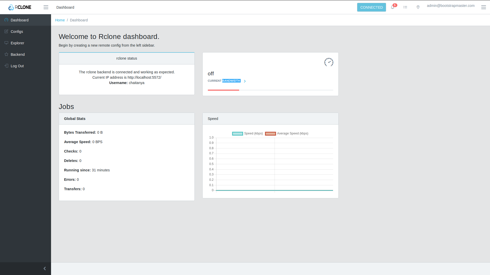
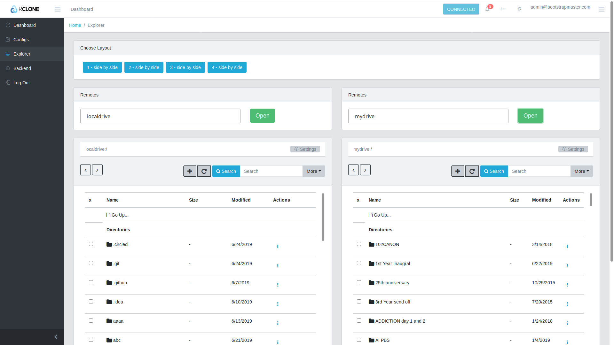

# Rclone Web UI  [](https://summerofcode.withgoogle.com/projects/#5104629795258368)

[](https://www.ccextractor.org/) [](https://rclone.org/)
## About

This project is developed as a part of Google Summer of Code '19 under [ccextractor.org](ccextractor.org) and [rclone.org](rclone.org) by [negative0](https://github.com/negative0).

This is a reactjs based web UI for the rclone cli project @ [Rclone Website](rclone.org)  

### Work Products (GSoC):

- Proposal for developing this project: [here](https://docs.google.com/document/d/1l6OHrM2XemHP-l2_iBdYPdPNVgiSB5t1es_-0ogrty0/edit?usp=sharing)
- The latest automated build can be found here: http://rclone.github.io/rclone-webui-react
- GSoC phase I plan: [here](http://good2be.me/blog/gsoc-phase-i.html)
- The thread for beta testing is here: https://forum.rclone.org/t/beta-testing-webgui-for-rclone/11156

## Intro

This project can be unstable and is being actively developed. Feel free to create any issues, feature requests or enhancements as you encounter them. 

## Build Status

[](https://travis-ci.com/rclone/rclone-webui-react) 
[](https://greenkeeper.io/)
[](https://coveralls.io/github/rclone/rclone-webui-react?branch=master)

## Getting Started

The project currently requires you to install and configure react and npm to run correctly.
Read more about the project details at [good2be.me](http://good2be.me/blog)

## Running the project through rclone:

If you have rclone installed, you can easily run this UI through rclone without any additional configuration.

Note: The instructions for installing rclone can be found [here](https://rclone.org/install/).

To run the web-gui, simply run the following command:

```shell script
    rclone rcd --rc-web-gui --rc-user=<user> --rc-pass=<pass> 
```
The web-gui should now be available at the url http://localhost:5572

### Parameters:
--rc-web-gui - run the web-gui

--rc-user - username to be used for login (Optional) default is gui.

--rc-pass - password to be used for login (Optional) if not provided, rclone will generate one for you.

--rc-addr - useful if you are running rclone on a headless machine, specify the private/public IP of your VM for rclone to bind to. (Optional)

--rc-web-gui-update - Force update web-gui to the latest version.


## Screenshots
### Dashboard


### Login


### Remote Explorer


### Creating config


## Get the automated script and get running

**Bash users:**

Download the sh file given here: 
[webui.sh](https://raw.githubusercontent.com/negative0/rclone-webui-react/master/package.json)

Copy the file to root folder of rclone.

```
cp webui.sh <root-of-rclone>/
```
First of all open the webui.sh

You need to edit this code to the username and password you would like to use.
```
username='<your-username>'
password='<your-password>'
```
Save this file.

Now you can run the following commands:

- Download the project:
```
./webui.sh get
```

- Build the webui app:
```
./webui.sh build
```

- Run the app with rclone backend:
```
./webui.sh run
```

- At any point, you can update the webui with new changes from the repo (optional):

```
./webui.sh update
```


**Windows:**
Coming soon

### Get the Project
```
    git clone https://github.com/negative0/rclone-webui-react
```
OR download a zip from the option above.

### Install dependencies
If you are using NPM:

**Make sure that you are using the latest LTS version of NPM**
```
    cd <cloned directory>
    npm install 
```

Using yarn:
```
    cd <cloned directory>
    yarn install
```


### Run the project
```
    npm start
```
OR
```
    npm run start
```

### Run tests
```npm test```OR ```yarn test``` if you want to run all jest tests. 
Test specific environment can be set using setupTests.js

**With Coverage**: ```npm run test:cov```


### Run Rclone
You have to run rclone with the following flags:
```
    rclone rcd --rc-user=<username> --rc-pass=<password> --rc-serve
```
Replace username and password with your custom username password. This will be required to login to rclone. rc-no-auth is not available due to security concerns.

--rc-serve:  It serves the remote objects at localhost:5572/[remoteName:remotePath]/path/to/file. It enables us to download files via the RemoteExplorer through the browser.

## Progress

For the progress and future implementation details please refer Progress.md


